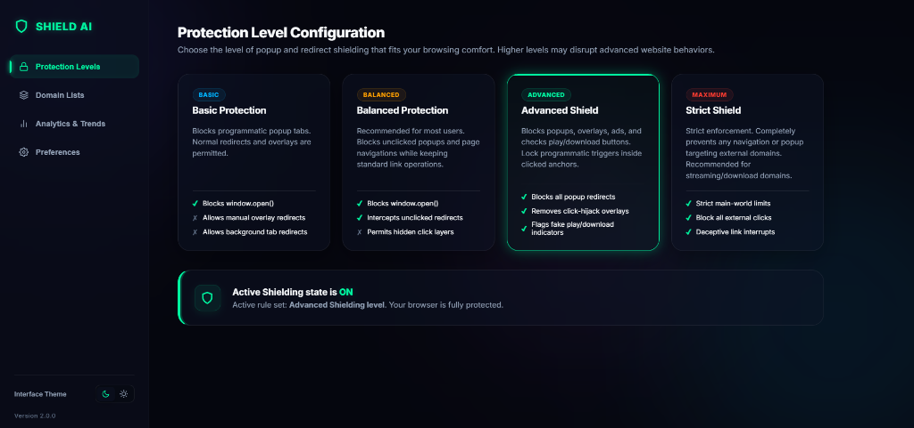
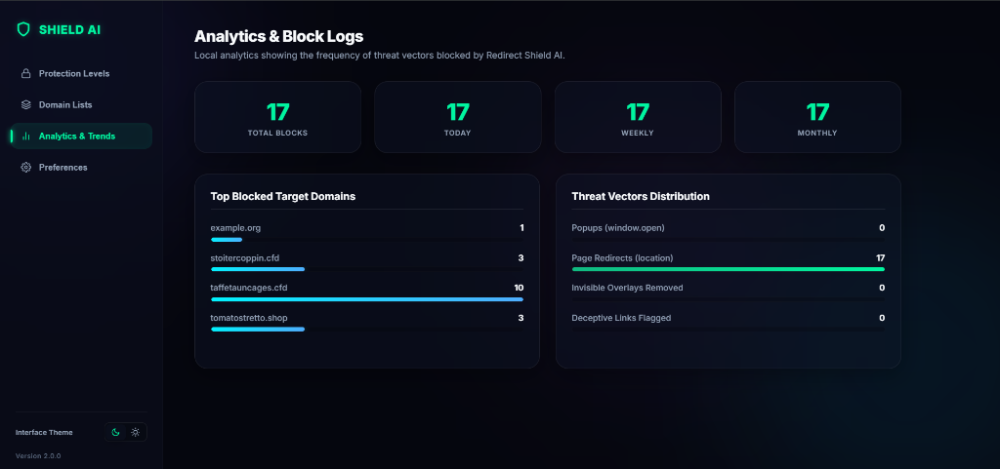
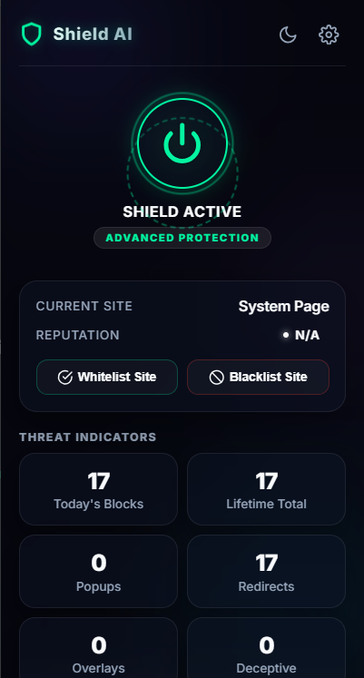

# Redirect Shield AI

Redirect Shield AI is a professional-grade, lightweight browser security extension built for modern Manifest V3. It intercepts malicious redirects, programmatic click hijacking, invisible ad overlays, and deceptive fake download links on streaming, media, and manga sites—while preserving normal website functionality.

## 📸 Visual Previews

### Settings Dashboard (Protection Levels)


### Settings Dashboard (Analytics & Insights)


### Popup Dropdown UI


---

## 🚀 Key Features

1. **Main-World API Override**: Overrides core browser endpoints (`window.open`, `Location.prototype.assign`, `Location.prototype.replace`, `history.pushState`) inside target page contexts to stop programmatic redirections.
2. **Overlay Capture Blocker**: Scans page layouts during runtime to identify and automatically delete transparent full-page click overlay divs.
3. **Deceptive Element Flagging**: Detects fake play/download buttons based on styling and keywords, highlights them, and prompts click confirmations.
4. **Local Reputation Assessment**: Rates domain safety (Safe, Warning, Suspicious) based on block counts and suffixes without making remote network requests.
5. **Modern Glassmorphic UI**: Includes a responsive popup and settings dashboard supporting dynamic aurora background circles and dark/light themes.
6. **Data Backups & Exports**: Back up whitelists, blacklists, and block statistics to a local JSON file, or restore them easily.

---

## 📂 Project Directory Structure

```
RedirectShieldAI/
├── manifest.json         # Extension Manifest V3 configuration settings
├── background.js         # Service worker tracking global states & action badge counts
├── content.js            # Coordinator running DOM overlays and MutationObservers
├── inject.js             # Main-world execution script overriding window redirection hooks
├── utils/                # Modular shared utility files
│   ├── logger.js         # Timestamps logger supporting DEBUG, INFO, WARN, and ERROR
│   ├── storage.js        # Wrappers managing local storage settings and stats records
│   ├── helpers.js        # Normalizes domains and provides throttle/debounce controls
│   ├── rules.js          # Protection level rules evaluator
│   ├── detector.js       # Heuristics checking fake downloads & domain reputation
│   ├── overlay.js        # Overlay capture shield detecting and deleting transparent layers
│   └── toast.js          # Injected Shadow DOM alert toasts
├── popup/                # Popup Action Dropdown UI
│   ├── popup.html
│   ├── popup.css
│   └── popup.js
├── options/               # Full Browser Tab Dashboard Settings
│   ├── options.html
│   ├── options.css
│   └── options.js
├── README.md             # Architecture, permissions, and developer guides
├── LICENSE               # Open-source licensing agreement (MIT)
├── CHANGELOG.md          # Release version updates
└── PRIVACY_POLICY.md     # Data privacy policy
```

---

## 🛠️ Architecture Details

Redirect Shield AI is engineered with a modular separation of concerns. Common modules (logger, storage helper, etc.) are imported into service workers using `importScripts` and parsed in content scripts via the `manifest.json` scripts array.

```
                  ┌──────────────────────┐
                  │  chrome.storage      │
                  └──────────▲───────────┘
                             │ (Promise sync)
┌──────────────┐  Message    ├──────────────────────┐  Message    ┌──────────────┐
│ Popup UI     ├────────────►│ background.js        │◄────────────┤ options.html │
│ (popup.js)   │  Sync       │ (Service Worker)     │  Sync       │ (options.js) │
└──────────────┘             └──────────▲───────────┘             └──────────────┘
                                        │ (Runtime Msg)
                               ┌────────┴───────────┐
                               │ content.js         │ (Isolated World)
                               │ (Content Script)   │
                               └────────▲───────────┘
                                        │ (postMessage config / block triggers)
                               ┌────────┴───────────┐
                               │ inject.js          │ (Main Page World)
                               │ (Prototype hooks)  │
                               └────────────────────┘
```

- **Main-World Prototype Overrides**: Since standard content scripts run inside isolated environments, they cannot hijack page-level JS variables. We inject `inject.js` directly into the page's DOM context to override properties (like `Location.prototype.href`) synchronously.
- **Throttled MutationObservers**: To prevent lags during heavy scrolling, changes are caught using `MutationObserver` triggers throttled to a maximum rate of once every 400ms.
- **Sandboxed Alerts**: Notification warnings are rendered inside a closed `Shadow DOM` tree attached to a custom container, preventing host site stylesheets from polluting the notification design.

---

## 📦 Installation Guide

To load the extension unpacked for development or auditing:
1. Open Google Chrome, Microsoft Edge, Brave, or Opera.
2. Navigate to: **`chrome://extensions/`**
3. Turn on the **Developer Mode** toggle switch (top-right corner).
4. Click the **Load unpacked** button (top-left corner).
5. Choose this project directory folder.
6. The extension is now loaded and will display in your browser toolbar!

---

## 🔒 Permissions Guide

Redirect Shield AI requests standard Manifest V3 developer permissions. Each permission is described below in accordance with Chrome Web Store Policies:

- **`storage`**: Used to save whitelists, blacklists, metrics logs, theme preferences, and configurations settings locally in the browser profile.
- **`tabs`**: Used to identify active tab URLs, update the address indicators, and send reload commands when configuration rules update.
- **`activeTab`**: Provides temporary permission to check the active webpage’s hostname and safely execute DOM checks.
- **`scripting`**: Required to run main-world overrides and perform script injection audits securely.
- **Host Permission (`<all_urls>`)**: Required to run the blocker script on all web address hostnames. Overriding redirects must occur instantly at page launch on all hosts to prevent bypass loops.

---

## 🧪 Testing Guide

We provide a local test sandbox `test_sandbox.html` inside the project folder. To run tests:
1. Open Chrome and load the extension unpacked.
2. Double click the `test_sandbox.html` file or drag it into Chrome.
3. Test the sandbox sections:
   - **window.open()**: Try triggering a popup; it will block it and show a toast notification.
   - **Page Redirections**: Try setting location properties; they will be blocked.
   - **Target Blank**: Click external blank links; they will load in the same tab instead.
   - **Invisible Overlays**: Click the overlay button to spawn a full viewport layer. Observe that the extension detects and deletes it instantly.
   - **Fake Downloads**: Flag deceptive play/download buttons and inspect warning highlights.

---

## 🛡️ Privacy Policy Summary

Redirect Shield AI operates fully locally.
- **No data collection**: Domain logs, stats, and configurations are kept in browser storage.
- **No tracking**: The extension does not collect analytics or track history.
- **No remote calls**: All threat ratings and overlay checkers run offline on your machine.
- **Open Source**: Auditable code, fully policy-compliant.
