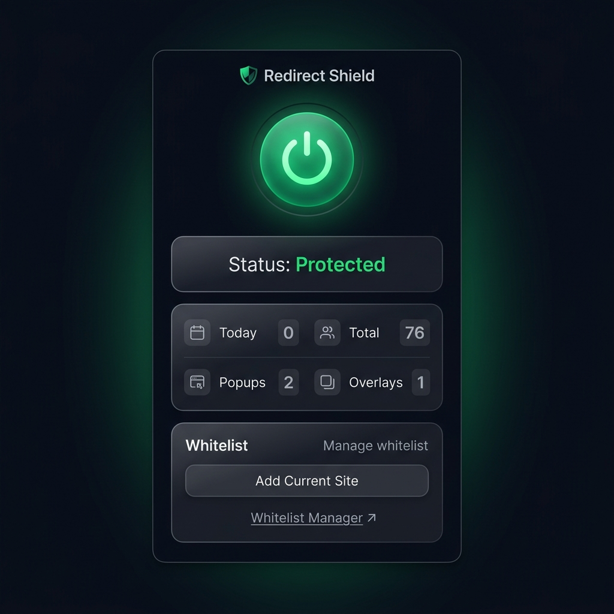
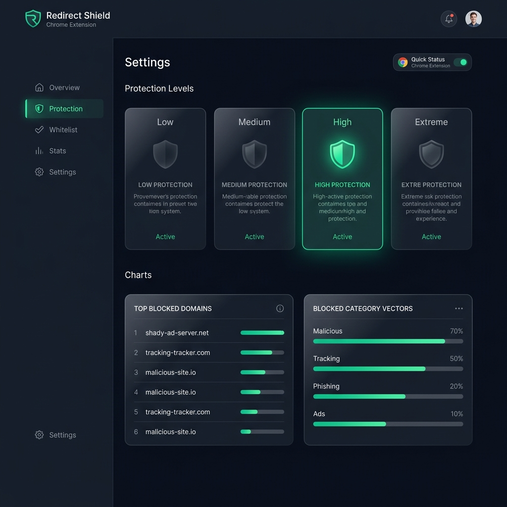

# Redirect Shield

**Redirect Shield** is a lightweight, professional-grade browser extension built with modern Manifest V3, pure Vanilla JavaScript, and gorgeous glassmorphic CSS. 

Its primary objective is to eliminate malicious redirects, click hijacking, invisible ad overlays, fake download triggers, and unwanted popup windows on streaming, media, and manga sites—while preserving normal website behaviors.

---

## 🚀 Key Features

*   **Main-World JavaScript Interception**: Overrides and blocks programmatic hooks on `window.open`, `Location.prototype.assign`, `Location.prototype.replace`, and `History.prototype.pushState`.
*   **Capture-Phase Click Hijacking Shield**: Traps document click events before they can fire on ad-listeners, preventing immediate tab-spawns.
*   **Invisible Overlay Removal**: Identifies and automatically cleans absolute/fixed transparent overlay `div` layers designed to redirect user clicks.
*   **Flexible Whitelist & Blacklist**: Lets users manage domains to trust (fully bypassed) or restrict (always locked to Extreme protection).
*   **Custom Protection Levels**:
    *   **Low (Basic)**: Block basic window popups.
    *   **Medium (Moderate)**: Block popups and non-user-triggered page redirections.
    *   **High (Advanced - Recommended)**: Block popups, redirects, overlay elements, and dynamic ads.
    *   **Extreme (Strict)**: Hard locks all external redirections (useful for streaming/download domains).
*   **Analytics Engine**: Tracks statistics by day, week, month, and vectors (popups, redirects, overlays) with top-blocked domain tracking.
*   **Intelligent Toast Notifications**: Injects a custom Shadow-DOM alert inside the page to warn about blocked events without website CSS pollution.
*   **Keyboard Shortcut Support**: Toggle the shield on/off instantly with a key combination.

---

## 📸 Screenshots

### Extension Popup


### Settings Dashboard & Analytics


---


## 📂 Project Directory Structure

```
RedirectShield/
├── manifest.json         # Extension Manifest V3 declarations
├── background.js        # Background service worker (state, storage, commands)
├── content.js           # Document Start page listener (configs, observer, shadow-toasts)
├── inject.js            # Main-world window API override targets
├── popup/               # Glassmorphic extension drop-down controls
│   ├── popup.html
│   ├── popup.css
│   └── popup.js
├── options/             # Dashboard and configurations panel
│   ├── options.html
│   ├── options.css
│   └── options.js
└── icons/               # Security brand assets
    ├── icon16.png
    ├── icon48.png
    └── icon128.png
```

---

## 🛠 Installation Instructions

1.  Clone or download this repository to your local computer.
2.  Open **Google Chrome** (or Microsoft Edge / Opera / Brave).
3.  Navigate to the Extensions dashboard by entering `chrome://extensions/` in the address bar.
4.  Enable **Developer mode** by toggling the switch in the top-right corner.
5.  Click on **Load unpacked** in the top-left corner.
6.  Select the `RedirectShield` root directory.
7.  The extension is now ready! Pin it to your browser toolbar to get started.

---

## 🛡 Explanations of Permissions

*   `storage`: Used to save the user configuration parameters (shield state, whitelist, blacklist, preference variables, analytics).
*   `tabs` & `activeTab`: Used to query the current active website domain when clicking the popup extension window.
*   `scripting`: Necessary to inject main-world scripts (`inject.js`) on the target web pages.
*   `host_permissions` (`<all_urls>`): Needed to execute content script shielding on any domain the user navigates to.

---

## 🔒 Privacy Policy

*   **Zero Data Collection**: Redirect Shield operates fully client-side and offline.
*   **No Remote Services**: It never sends tracking data, metrics, or logs to remote servers. All stats and settings remain saved locally in `chrome.storage.local`.
*   **No Tracking Libraries**: Built without NPM node packages or tracking trackers.

---

## 🗺 Future Roadmap

- [ ] **AI-Based Ad Pattern Detection**: Implement heuristics to automatically classify overlay containers.
- [ ] **Cloud Sync**: Sync settings across computers using encrypted user keys.
- [ ] **Community Block Lists**: Dynamically update domain lists from community sources.
- [ ] **Firefox & Safari Ports**: Port the codebase to support MV2/MV3 on Safari and Gecko engines.
