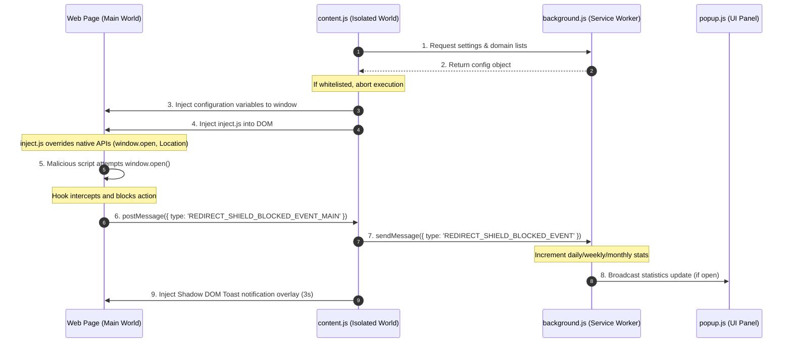

# NexShield - Technical Documentation

NexShield is a high-fidelity browser extension built on Chrome Extension Manifest V3. It intercepts and prevents advertisements, popups, click hijacking, and malicious redirects on streaming and download sites, while keeping normal web operations running smoothly.

---

## 🏛 Architecture & Communication Flow

Modern browser extensions run content scripts in an **Isolated World** context. This sandbox protects user data but prevents content scripts from modifying variables or function signatures inside the page's original context (the **Main World**).

To intercept native JavaScript redirection vectors, NexShield uses a hybrid injection strategy:

---

## 🧠 Business Logic & Redirection Classification

### 1. User Interaction Identification
Malicious scripts often trigger popups by registering standard click listeners or using timers. NexShield distinguishes legitimate user actions from programmatic scripts by tracking user activity:

*   Whenever a user triggers `click`, `keydown`, `touchstart`, or `mousedown`, a global boolean `isUserInteracting` is set to `true`.
*   A `setTimeout` window resets `isUserInteracting` to `false` after **800ms**.
*   If `window.open` or location parameters modify values when `isUserInteracting` is `false`, the redirect is blocked as an automatic ad behavior.

### 2. External Domain Detection
Legitimate page actions (like logging in via Google/Github or navigating subdomains) should not be blocked. NexShield parses target URLs to check if they are external:
*   Redirection targets matching relative paths (`/path`), anchor tags (`#section`), local files (`.html`), or special schemes (`javascript:`, `mailto:`, `tel:`) are allowed.
*   We extract hosts and verify if target hosts match the root host or subdomains of the active page (e.g., `api.example.com` on `example.com` is allowed).
*   OAuth providers are allowed during normal clicks, but blocked if triggered programmatically without user consent.

### 3. Click-Hijacking (Invisible Overlays)
Streaming sites often overlay an invisible transparent `div` across the entire screen. A click anywhere triggers an ad popup and removes the overlay. NexShield blocks this using a throttled `MutationObserver` scan:
*   **Dimensions**: Elements matching viewport bounds (`width >= 85vw` and `height >= 85vh` or `width/height: 100%`).
*   **Layering**: Elevated stacks (`z-index >= 90`) with `position: fixed` or `position: absolute`.
*   **Transparency**: Background colors set to `transparent`, low alphas (`rgba(..., 0)`), or structural opacities `< 0.12`.
*   **Pointer Events**: Captures mouse events (`pointer-events` is not `none`).
*   **Content Scans**: If the overlay contains zero text and no inputs (`button`, `input`, `textarea`), it is deleted.

---

## 📂 Code Deep-Dive

### 1. manifest.json
Declares metadata and browser bounds.
*   `permissions`: `storage` (saves user stats and options), `tabs` and `activeTab` (retrieves hostname URL), `scripting` (permits context injection).
*   `host_permissions`: `<all_urls>` (shields any web domain).
*   `web_accessible_resources`: Exposes `inject.js` so target websites can load it securely.
*   `commands`: Binds keyboard shortcut `Ctrl+Shift+B` to toggle extension protection.

### 2. background.js (Service Worker)
Manages extension lifecycle and global state.
*   **Lifecycle**: Initializes default storage parameters (whitelist, blacklist, default high-protection level, counters) on installation.
*   **Badge Control**: Displays an `ON` green badge or `OFF` red badge on the extension icon. Shows a dynamic count of blocked items specific to the active tab.
*   **Stats Manager**: Tracks daily, weekly, and monthly block counts. Aggregates data by cleaning up and resetting dates. Counts entries inside a `topDomains` key.

### 3. content.js (Content Script)
Runs at `document_start` to execute prior to target web scripts.
*   **Configuration Ingestion**: Reads storage, matches current host name against whitelist/blacklist arrays, and injects configuration variables directly into `window.__REDIRECT_SHIELD_CONFIG__` before executing DOM scripts.
*   **DOM Observer**: Listens to mutations, debouncing scans to run at most once every **400ms** to prevent layout rendering lag.
*   **Toast Notifications**: Appends a Shadow-DOM container `redirect-shield-toast-container` to the page. Renders slide-in warning alerts isolated from webpage style pollution.

### 4. inject.js (Main World Injector)
Directly modifies window APIs.
*   **window.open**: Hooks the native method. If blocking rules match, returns `null` (matching browser specifications).
*   **Location prototype**: Overrides `.assign()` and `.replace()` prototype methods. Hooks the `href` setter descriptor to prevent redirects.
*   **History prototype**: Overrides `.pushState()` and `.replaceState()`.
*   **Anchors modifier**: Listens to document click captures. Converts links with `target="_blank"` leading to external domains to target `_self` (open in same tab).

### 5. UI Panels (popup/ and options/)
*   **Design system**: Custom glassmorphism layout, utilizing dark slate backgrounds (`#0b0f19`), translucent panels (`backdrop-filter: blur()`), glowing borders, and neon-green indicators.
*   **Dashboard features**: Options dashboard containing tab navigation panels, custom CSS analytical progress bars mapping vectors, import/export json systems, and domain array editors.

---

## 🚀 Execution & Verification Guide

### Loading the Extension
1.  Open **Google Chrome** (or Edge, Brave, Opera).
2.  Navigate to `chrome://extensions/`.
3.  Turn **Developer Mode** on (top-right toggle).
4.  Click **Load unpacked** (top-left button).
5.  Select the project directory: `c:\Users\ASUS\Desktop\redirect shield`.

### Running Verification Tests
Open the sandbox file [test_sandbox.html](file:///c:/Users/ASUS/Desktop/redirect%20shield/test_sandbox.html) in your browser.

*   **Test window.open()**: Click `Run window.open()`. The extension will block it, output a log in the console (press F12 to check console logs starting with `[NexShield]`), and display a bottom-right toast message.
*   **Test Location Redirect**: Click `Set location.href`. The script intercepts the property override and blocks page redirection.
*   **Test Click Hijacking**: Click `Spawn Invisible Hijack Overlay`. An invisible container layer is added to the DOM. Notice the status badge switches to **ACTIVE** and instantly reverts to **INACTIVE** as the extension deletes the element.
*   **Toggle State**: Press the key combination (`Ctrl+Shift+B` or fallback configurations). Open the extension popup to watch stats update dynamically.
